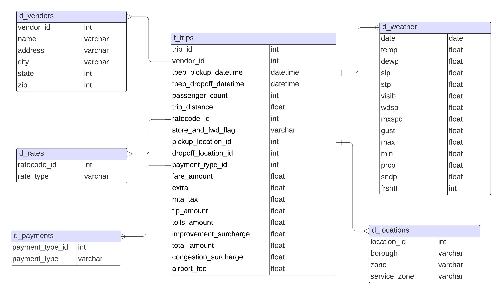

# Incremental Data Ingestion Pipeline | GCP Data Engineering Project

## Introduction

In this project, I implemented an Incremental Data Ingestion Pipeline, as suggested in [this Google blog](https://cloud.google.com/blog/products/data-analytics/optimizing-your-bigquery-incremental-data-ingestion-pipelines), using the TLC trip records and NOAA New York weather public datasets.

These websites are regularly updated with fresh data and let's say, we would like continuously stream the new data to the local databases. 

Firstly, I set up a data model in BigQuery based on the relationships desribed in the data dictionary [here](https://www.nyc.gov/assets/tlc/downloads/pdf/data_dictionary_trip_records_yellow.pdf). 

Employing Google Composer (Airflow) capabilities, I developed a  workflow to extract data from both the TLC and NOAA websites on a monthly basis, store it in Google Cloud Storage, and then efficiently load it into BigQuery tables by using a `staging` dataset and utilizing `MERGE INTO` statement.

This approach allows for the seamless merging of new data, ensuring data integrity and optimized processing costs.

## Datasets

TLC Yellow Taxi Trip Records include fields capturing pick-up and drop-off times/locations, trip distances, fares, rate types, payment types, and passenger counts.

NOAA Daily Weather Summaries for Central Park station includes fields capturing daily average temperature, sea level pressure, station pressure, wind speed, maximum wind gust, total precipitation and weather indicator. This dataset was added to facilitate the futher analysis of colleration between trip demand and weather conditions.

More information about the datasets can be found here:

TLC Trip Record Data website - https://www.nyc.gov/site/tlc/about/tlc-trip-record-data.page

NOAA website - https://www.ncei.noaa.gov/access/search/data-search/global-summary-of-the-day

## Architecture 

## Data model

## Step 1: Constructing the data model

- Initiate a Google Cloud project, set up Cloud Storage, and enable the Cloud Composer service. 

- Upload `create_data_model_dag.py` to the dags folder in the Composer environment.

- Being run successfully, a database will be created in BigQuery like below:

 

 

Time-partitioning is applied to `f_trips` considering its potentially high volumes of records for better query performance.

## Step 2: Running ingestion pipeline

- Upload `ingest_data_dag.py` to the dags folder in the Composer environment.

### Applied data processing steps

- Add the `trip_id`. For simplicity, use the row numbers of records in the `f_trips` table as the `trip_id`
- Identify and cast to null any invalid inputs in the columns: `vendor_id`, `ratecode_id`, `store_and_fwd_flag`, and `payment_type_id`.
- Eliminate records where both `trip_distance` and `fare_amount` values are equal to 0, as these entries are likely due to recording errors.

## References

- [How to reduce the cost of BigQuery incremental data ingestion pipelines](https://cloud.google.com/blog/products/data-analytics/optimizing-your-bigquery-incremental-data-ingestion-pipelines)